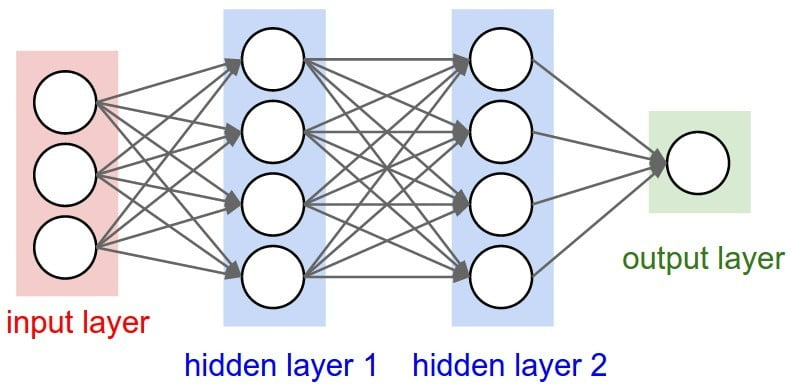
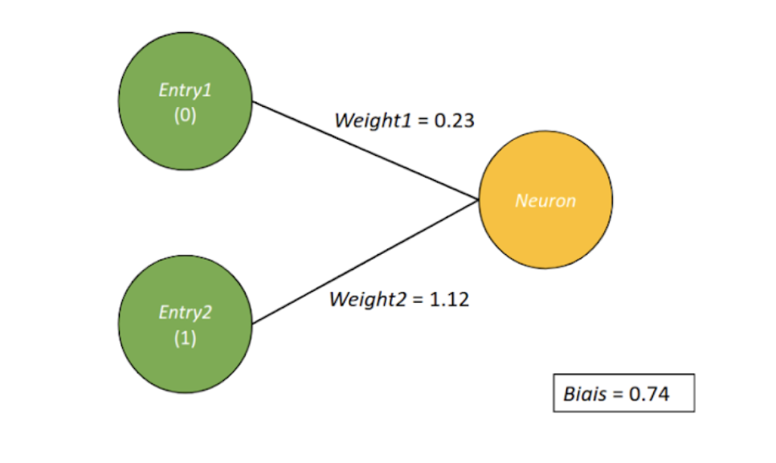
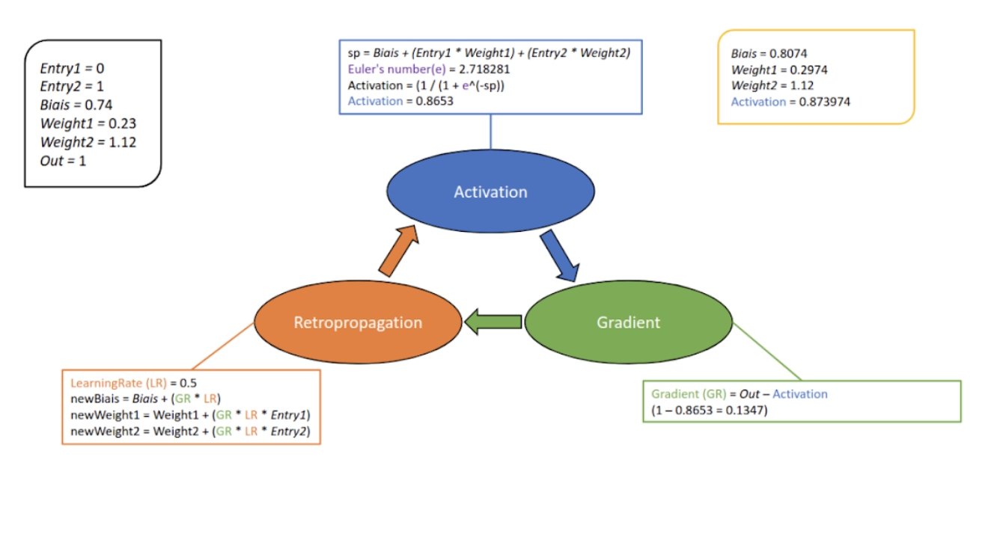
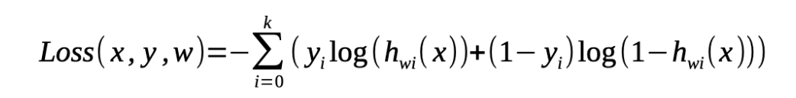
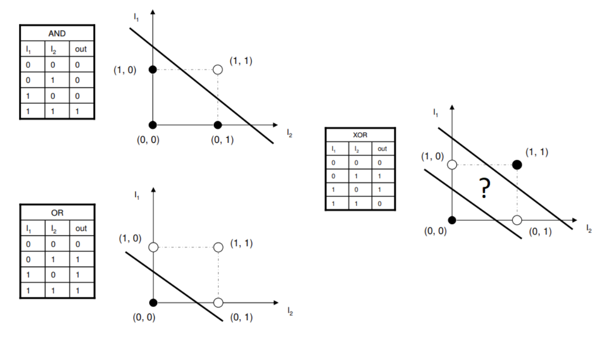

# Workshop

Durant cette deuxième journée de piscine, vous allez créer votre premier réseau de neurones.
Pour commencer, allez jusqu'au bout de ce jupyter notebook
[introduction](https://github.com/vincent-lemesle/workshop_IA_2019/tree/master/2.Regression_logistique)
Un réseau de neurones artificiels
est un système dont la conception est à l'origine schématiquement
inspirée du fonctionnement des neurones biologiques.
 
Les réseaux de neurones sont généralement optimisés par des méthodes d’apprentissage comme le
[supervisé](https://machinelearnia.com/apprentissage-supervise-4-etapes/)
que nous allons découvrir pendant cette journée.
 
 
Nous pouvons en schematiser un comme ceci:

Un réseau de neurones est un ensemble de couches de neurones qui ont chacune une fonctionnalité.
Ici nous pouvons distinguer trois catégories:
 - couche d'input
 - couche cachée
 - couche de sortie

Le but de cette journée est donc vous faire développer le votre.
 
Avant toute chose, vous allez développer un seul et unique neurone.
 

Un neurone va prendre X nombre de valeurs et en ressortir un output.
 
Comme vous pouvez le voir ci-dessus, le neurone stock des poids liés aux inputs ainsi qu'un biais (également un poids mais qui n'est pas lié à un input).
 
 
Afin de ressortir ce fameux output, il va multiplier ses poids avec les inputs qu'on lui aura donné
et y ajouter son biais.
Nous pouvons ensuite comparer cette output avec celui que nous aurions aimer avoir.
 
Prenons l'exemple de la porte logique OR. Nous pouvons constater ci-dessus que nous envoyons
0 et 1 en inputs (Entry1/Entry2). D'après la porte OR l'output devrait être égal 1.
 
Pour que notre neurone ressorte ce même output, vous allez devoir l'entraîner!
 
Vous allez adapter ses poids afin qu'il se rapprochent le plus du résulat attendu.

# Exercices

En suiviant le shéma ci-dessus, créer une classe "Neuron" qui prend un paramètre le nombre d'inputs du neurone.
 
[tuto class python](https://www.w3schools.com/python/python_classes.asp)

Attributs:
- "_activate" nombre initialisé à 0.
- "_gradient" nombre initialisé à 0.
- "_bias" nombre aléatoire entre -1 et 1.
- "_weights" liste de nombre aléatoire entre -1 et 1, sa taille est égale au nombre d'inputs.

Méthodes:
- "activate" Cette fonction (sigmoid), servira à set "_activate" de notre classe
- "calculateOutputGradient" Cette fonction, servira à set "_gradient" de notre classe
- "applyGradient" changer les poids pour qu'ils s'adaptent à notre résulat attendu.

Réaliser un apprentissage de votre neurone pour la porte logique and.
Pour notre neurone, sa fonction d'activation est une
[sigmoïd](https://fr.wikipedia.org/wiki/Sigmoïde_(mathématiques))
.
 
Son "_activate" sera donc entre 0 et 1. Si l'activation du neurone est >= 0.5, il est égale à 1 et à l'inverse 0.
 
Nous pouvons donc maintenant le comparer à notre résultat attendu.
 
Réfléchissez bien aux valeurs de vos paramètres comme le
[taux d'apprentissage](https://towardsdatascience.com/understanding-learning-rates-and-how-it-improves-performance-in-deep-learning-d0d4059c1c10)
ou même le nombre de fois ou vous allez adapter les poids de votre neurone (Epoch).
 
inputs = [[0, 0], [1, 0], [0, 1], [1, 1]]
 
output = [0, 0, 0, 1]

Afin de voir si votre entraînement fonctionne bien, vous allez implémenter une méthode "compute-loss" à votre classe.
 
Ce genre de fonction, s'appelle fonction de coût. Elle retourne un nombre correspondant à votre erreur
en comparant les valeurs que vous avez à celles que vous attendez.
Plus ce nombre est grand plus votre neurone est dans l'erreur.
 
La fonction que nous allons utiliser se nomme la cross entropy

x représente les inputs, y les sorties attendues et h(x) les sorties calculés par les neurones en fonction des inputs.
 
Implémenter cette fonction dans votre class neurone.
 
[en savoir plus sur la fonction](https://en.wikipedia.org/wiki/Mean_squared_error)

# Problème du perceptron

Un neurone seul peut uniquement résoudre des problèmes linéairement résolvables,
comme des portes logiques tel que le OR ou le AND. Le XOR quand à lui n’est pas linéairement résolvable.
 

Nous devons donc utiliser plusieurs perceptrons pour remédier à ce problème.
 
C'est la que les réseaux de neurones entreront en jeux.
 
Chaque couches de votre réseau de neurones sera une simple liste de Neuron
 
(tips: les inputs peuvent être considéré comme une couche)
 
Rajouter dans votre class Neuron les methodes suivantes:
- "activateWithLayer" prend en paramètre la couche précédante de votre réseau.
Le calcul de la somme sera le biais plus chaque poids multiplier par l'activation neuron associé
- "calculateHiddenGradient" prend en paramètre la prochaine couche et un index sur un poids.
Pour calculer le gradient, faire la somme du gradient et du poids à l'index pour chaque Neuron dans la couche suivante
 
Le gradient sera égal à (1 - self._activation) * self._activation * sum. Dont sum est le calcul d'avant.
- "applyGradientWithLayer" applique le gradient pour chacun de ses poids.

Créer une class NeuralNetwork qui prend en paramètre une liste de couches tel que [2, 2, 1] pour 2 inputs, 2 neurones cachés et 1 neurone d'output.
Cette class aura comme attribut uniquement une liste de couches créer pendant sont initialisation.
Implémenter les méthodes suivantes:
- "activate" active les neurones de chaques couches
- "getOutputs" renvoie l'activation des neurones de la dernières couches
- "calculateGradients" calcul le gradient de chaque Neuron pour chaque couches
- "applyGradients" applique le gradient de chaque Neuron pour chaque couches

Voici comment calculer la loss de votre réseaux:
<pre>
def calcLoss(self, inputs, outputs):
loss = 0.
for i in range(len(inputs)):
    self.activate(inputs[i])
    for i in range(len(self.layers[-1])):
        loss += outputs[i] * np.log(self.layers[-1][i]._activation) + (1. - outputs[i]) * np.log(1. - self.layers[-1][i]._activation)
    return -loss / len(inputs)
</pre>
