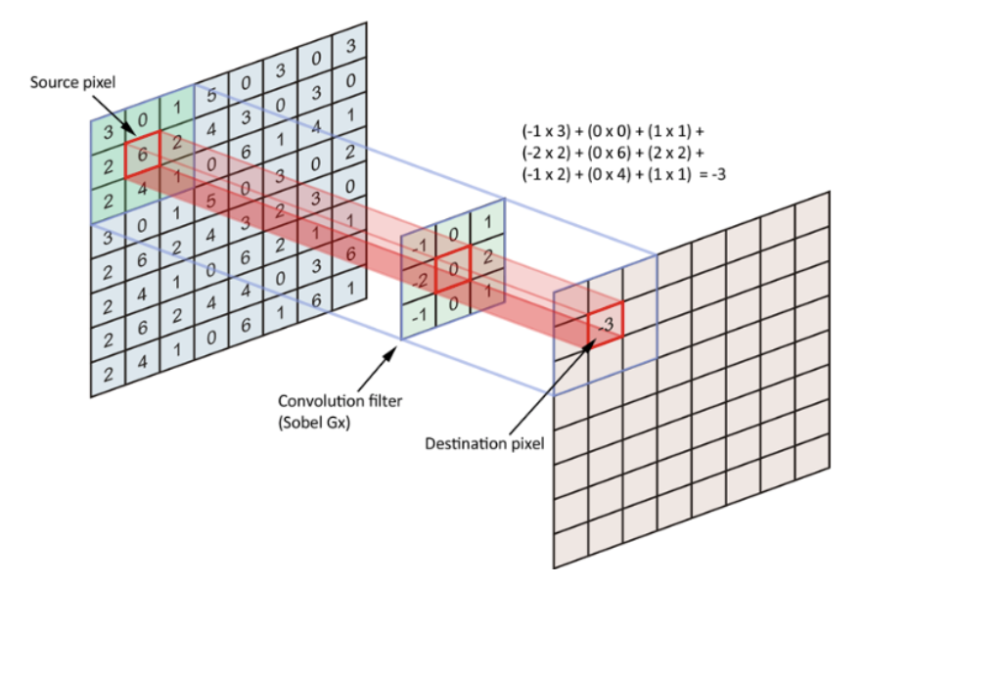
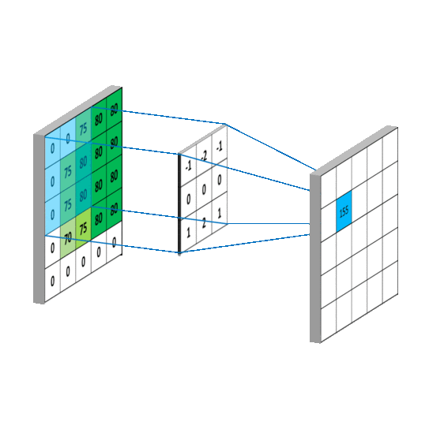
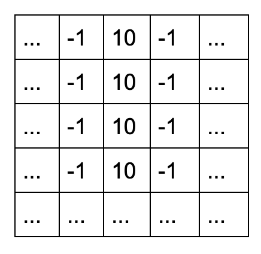
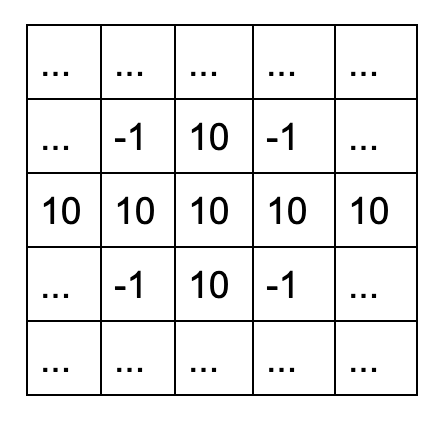
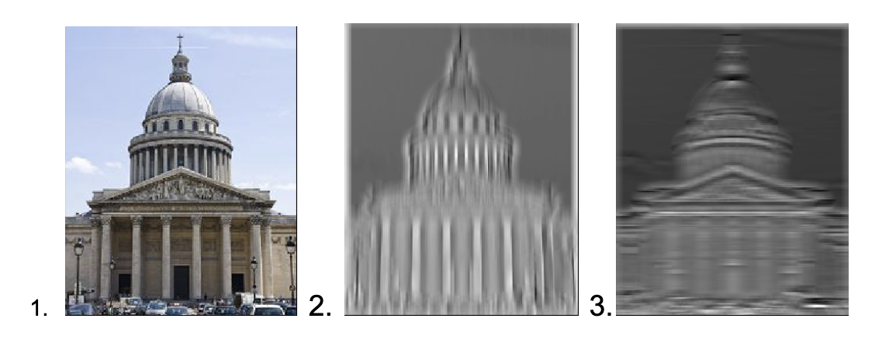

# Sujet day-4

Lors de l'entraînement d'un de vos réseau de neurons, plusieurs paramètres sont très importants.

Tout d'abord le choix du nombre de neurones et de couches.
 
Ce paramètre est très difficile à trouver sachant qu'il
n'y a pas de recette miracle afin de le connaître.
 
Afin qu'il soit le plus optimal possible ou du moins sans rapprocher, il faut tester
et voir à quel moment votre réseau est le plus fiable (meilleur taux de réussite) possible.

Le nombre d'Epochs est également très important à prendre en compte car si vous entraînez
trop votre réseau, vous pouvez faire de [l'overfitting](https://fr.wikipedia.org/wiki/Surapprentissage)
ce qui empechera de trouver des cas inconnus (cas non entraînés) pour un réseau
qui a pour rôle de classifier.

Le learning rate quand à lui peut être trouvé grâce à votre fonction loss.
 
Si votre loss descend d'un coup mais stagne vite c'est que le learning rate
peut être trop élevé par exemple.

Avant de continuer, renseignez vous sur un paramètre que vous ne connaissez pas, les Batch.
Lors d'un entraînement sur plusieurs milliers de données, le mieux n'est pas de tout donner à votre réseau.
Une solution possible est de choisir à chaque fois 100 données choisies aléatoirement par exemple.

Depuis plusieurs jours vous travaillez sur des réseaux de neurones completement
connectés (fully-connected)

Aujourd'hui vous aller aborder les réseaux de neurones convolutionnels (CNN)
  
Les CNN ont une ou plusieurs couches dans leur réseau qui serviront à appliquer une convolution
 
Le but de la convolution est de faire ressortir les données qui peuvent nous intéresser le plus.
 
Pour cela nous allons passer un “filtre” qui va nous
permettre de changer les valeurs de nos données.

Le filtre est de la dimension que nous souhaitons,
par exemple pour une image qui est donc un tableau de pixel (2d),
nous allons faire un filtre 2d.
 

 

 
Si nous voulons faire ressortir les formes verticales d’une image, le filtre que nous utiliserons peut être d’une dimension 15x15. Nous allons remplir le filtre avec des valeurs égales à -1 sauf la colonne du milieu, les valeurs seront de 10.

 
Pour faire ressortir les formes horizontales d’une image, le filtre sera le même sauf qu’au lieu d’avoir des valeurs égales à 10 sur la colonne du milieu, elles seront sur la ligne du milieu.

 
Voici un exemple de ce que l’on peut faire avec de la convolution,
l’image 1 est l’original, on a fait passer un filtre vertical sur
la 2eme et peut voir que les colonnes ressortent.
 
Avec un filtre
horizontal sur la 3ème et on peut voir que les barres du milieu
du panthéon sont ressorties.

Voici un schéma vous permettant de comprendre le fonctionnement complet d'un CNN.

Voici un lien vers un
[cours complet](https://towardsdatascience.com/a-comprehensive-guide-to-convolutional-neural-networks-the-eli5-way-3bd2b1164a53)
pour plus d'informations.

# Exercice

- Créer un CNN capable de classifier les données du dataset [Fashion-MNIST](https://pytorch.org/docs/stable/torchvision/datasets.html#fashion-mnist)
- Même exercice sur les données du dataset [Cifar-100](https://www.programcreek.com/python/example/105099/torchvision.datasets.CIFAR100)

 
 
Jusqu'à présent, tous les datasets sur lesquel vous deviez travailler étaient simples et parfaits.
 
Les datasets sont la base pour la réussite d'un entraînement.
 
En général vous devez souvent normaliser vos données afin de simplifier le travail de votre réseau.
 
Il est également important d'afficher graphiquement vos données afin de choisir lequel choisir.
 
Une donnée qui ne change jamais n'est pas forcément intérressante nottament.

# Exercice

Depuis le dataset suivant, [Card-Fraud](https://www.kaggle.com/mlg-ulb/creditcardfraud#creditcard.csv)

- Afficher vos données grâce à [matplotlib](https://matplotlib.org/)
- Determiner quelles données sont utiles à garder
- Créer un réseau de neurones afin d'avoir le plus haut taux de réussite possible sur la détection de fraude.
